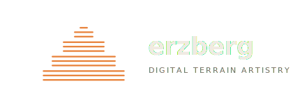

<p align="center">
  
</p>

[](https://github.com/sorny/erzberg/actions/workflows/deploy.yml)
[](https://opensource.org/licenses/MIT)

A topographic visualisation tool built on React Three Fiber. Load a greyscale heightmap or GeoTIFF and render it as 3D line art, structural relief, or architectural sketch using one or more of the twelve independent draw modes.

**Everything runs locally in your browser.** Your files never leave your machine — no server, no upload, no account.

**Live version:** [sorny.github.io/erzberg](https://sorny.github.io/erzberg/)

---

## Features

**Layered ghost occlusion.** Each line segment generates an invisible 3D curtain mesh that acts as a depth buffer. Lines occlude other lines rather than being swallowed by the terrain surface, and hidden segments can be rendered with a custom colour and opacity for an X-ray effect.

**Twelve draw modes.** Every mode runs independently with its own colour, weight, dash pattern, and hypsometric tinting:

| Mode | Technique |
|---|---|
| X Lines / Y Lines | Grid sampling along fixed axes |
| Crosshatch | Combined X + Y ridgelines |
| Pillars | Vertical extrusion per cell (line, cuboid, or cylinder shapes) |
| Contours | Marching Squares isolines, GIS-unit-aware |
| Hachure | Slope-directed short strokes |
| Flow Lines | Euler-integrated drainage paths |
| Stream Network | Strahler-order flow accumulation |
| Pencil Shading | Laplacian curvature detection |
| Ridge Detection | Hessian eigenvalue crest extraction |
| Valley Detection | Topographic Position Index troughs |
| Stipple Dots | Stochastic dot-density driven by slope or elevation |

**Surface overlays.** Hillshade (Lambertian GPU shader, configurable sun azimuth/altitude, separate highlight and shadow colours) and slope shading (two-colour steepness gradient blended over the fill).

**Hydraulic erosion.** Droplet-based simulation following [Hans Beyer's method](https://ardordeosis.github.io/implementation-of-a-method-for-hydraulic-erosion/thesis-beyer.pdf), running off the main thread in a Web Worker.

**Particle system.** Optional animated point cloud with noise-driven motion, gravity, and peaks-only mode.

**Exporters.** SVG (software Z-buffer projection, per-mode Inkscape/Illustrator layers), 4K PNG with MSAA (WebGLRenderTarget, trimmed to content), PNG α (transparent background), STL (watertight mesh for 3D printing), greyscale heightmap PNG, and WebM screen recording.

---

## Tech stack

| Layer | Library |
|---|---|
| 3D engine | React Three Fiber + Three.js |
| State | Zustand (heightmap data) + React state (all UI params) |
| GIS parsing | GeoTIFF.js |
| UI | Custom sidebar panel + Tailwind CSS |
| Geometry | Web Workers (geometry and erosion off-thread) |

---

## Documentation

- [Draw mode mathematics](docs/Draw-Modes.md)
- [Hydraulic erosion algorithm](docs/Hydraulic-Erosion.md)

---

## Development

```bash
npm install
npm run dev              # dev server at http://localhost:5173
npm run build            # production build
npm run test             # Playwright end-to-end suite
npm run test:ui          # Playwright interactive UI
npx playwright test tests/lines.spec.js   # single spec
npm run update-presets   # round-trip all presets through the live app
```

Tests run against a live dev server in non-headless Chrome with WebGL enabled.

---

## License

MIT — Copyright (c) 2026 sorny.
