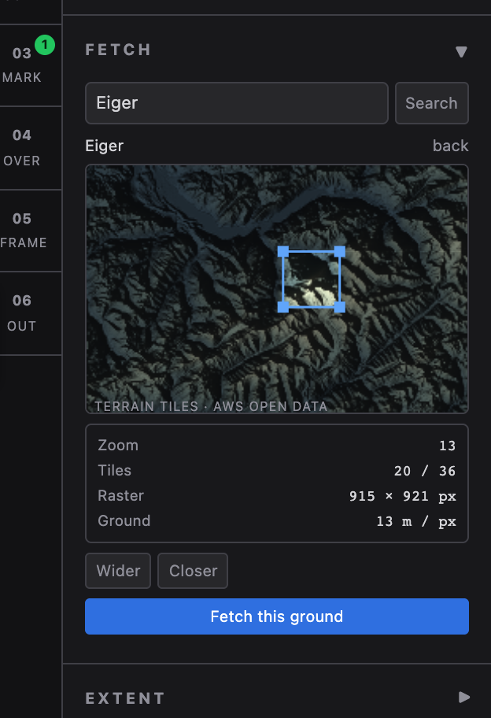

<p align="center">
  
</p>

<p align="center">
  <a href="https://github.com/sorny/erzberg/actions/workflows/deploy.yml"></a>
  <a href="https://opensource.org/licenses/MIT"></a>
</p>

<p align="center">
  Turn elevation data into line art. A topographic visualisation tool built on React Three Fiber.
</p>

<p align="center">
  <b><a href="https://sorny.github.io/erzberg/">sorny.github.io/erzberg</a></b>
</p>

---

Load a greyscale heightmap (8-bit or 16-bit PNG), a GeoTIFF, or an audio file.
The app renders it as 3D line art with 37 independent draw modes: surveyor's
marks such as hachures and contours, tone, relief, colour plates, light, and
tracks that something with mass laid down a face. Contours letter their own
heights.

Export to SVG for a pen plotter, to STL for a printer, or to 4K PNG for the wall.

**Everything runs locally in your browser.** Your files never leave your
machine. There is no server, no upload and no account, and the app makes no
third-party request on load. Three features contact a server, and only when you
press their button:

- *Vector Layers* asks OpenStreetMap for features inside the raster's extent.
- *Fetch* asks a geocoder for a place, then a tile host for the ground under it.
- *Satellite* asks an open archive for a Sentinel-2 scene over the extent.

Each sends a place name or a bounding box. None sends a file or needs a key.

<table>
  <tr>
    <td width="33%"></td>
    <td width="33%"></td>
    <td width="33%"></td>
  </tr>
  <tr>
    <td align="center"><sub><b>Unknown Pleasures</b> — stacked ridgelines</sub></td>
    <td align="center"><sub><b>Alpine Survey</b> — hypsometric fill, hillshade, contours</sub></td>
    <td align="center"><sub><b>Static</b> — slope-inverted stipple dots</sub></td>
  </tr>
  <tr>
    <td></td>
    <td></td>
    <td></td>
  </tr>
  <tr>
    <td align="center"><sub><b>Thermal Camera</b> — hypsometric fill + sky-view AO</sub></td>
    <td align="center"><sub><b>Copper Plate</b> — curvature engraving</sub></td>
    <td align="center"><sub><b>X-Ray</b> — lines and crosshatch, ghost-occluded</sub></td>
  </tr>
</table>

<sub>Six of the 56 bundled presets, rendered by the app's own PNG exporter from
the sample heightmap.</sub>

---

## Quick start

Use the [hosted version](https://sorny.github.io/erzberg/), or run it yourself:

```bash
npm install
npm run dev              # http://localhost:5173
```

The app opens on a bundled sample heightmap under a style preset. Pick a
different style from the grid, then tune it.

## The panel

- **Dark and light.** The sun or moon in the panel head switches the theme. The
  choice is remembered per browser. Both themes use the brand's own colours:
  iron, paper and ore. Ore is the one accent, and it means "on".
- **Stages.** A rail on the panel edge holds six stages in pipeline order:
  *Terrain, Surface, Marks, Overlay, Frame, Output*. The body shows one stage at
  a time. A *Presets* slot sits above them. Each tab shows a green count of the
  sections that are on inside it.
- **Marks sheet.** The Marks stage shows the 37 modes as tiles in six families:
  Line, Tone, Relief, Plate, Light and Momentum. The ring in a tile corner
  switches the mode on. The rest of the tile opens its controls.
- **Search.** The field at the top filters sections by title and by their own
  terms. Type `azimuth` and only Hillshade remains. The search crosses all
  stages.
- **Summaries.** A collapsed section shows its setting on the right, for example
  `315° · 60%`. A section that is off shows `—`. The head line counts what you
  composed: `4 marks · 3 inks · 2 layers`.
- **Session.** The app saves your parameters and text layers to the browser and
  restores them on the next visit. It does not store the raster.
- **Reset.** *Reset all* returns everything to defaults. A `↺` in a section header
  resets that section only. Both offer Undo for eight seconds.
  `src/components/panel/sectionParams.js` states what each section owns, and a
  unit test holds it against the panel source.
- **History.** `⌘Z` undoes. The `▾` beside Undo lists each named step, for
  example *Hillshade* or *Preset · Blueprint*. Click a step to jump to it.
- **Cost.** The stats line reports how long the last rebuild took. Most modes
  rebuild the sample in under 0.1 s. Sun Hours takes about 2 s. A spinner
  appears after 0.25 s, and a full-screen cover after 1.2 s.

---

## Input

| Source | Notes |
|---|---|
| **PNG** | 8-bit or 16-bit, decoded natively. Alpha is NoData. |
| **GeoTIFF** | Real elevation. The panel states the file's CRS, honours its NoData value, and suggests a vertical exaggeration from the pixel size. |
| **Audio** | MP3, WAV, OGG or M4A, analysed into a spectrogram that drives the terrain. See [Soundscapes](#soundscapes). |
| **GPX / GeoJSON** | Tracks, points, lines and polygons, draped over a georeferenced raster. |
| **Fetch** | Type a place. Nominatim resolves it, and a map lets you place and size the box before you download. The panel states the zoom, tile count, raster size and metres per pixel first. Tiles come from Terrain Tiles on AWS Open Data. |
| **OpenStreetMap** | Roads, water, rail, landuse, buildings, lifts and peaks inside the raster's extent, through Overpass. |
| **Satellite** | True-colour Sentinel-2 at 10 m from AWS Open Data. It drapes on the terrain and backs the Mask Studio. |
| **Mask** | A PNG, JPG or WebP stencil, a drawn mask, or a mask cut from features. See [Masks](#masks). |
| **Cover plate** | A `.landcover.json` from `scripts/embed-window.js`. See [Land cover](#land-cover). |



A smaller Fetch box gives a sharper raster, not a smaller file. The zoom is
always the finest that fits the 36-tile budget.

**Drag and drop.** Drop a file anywhere on the window. The app routes it by its
content, not by guess:

- A GeoTIFF becomes the terrain.
- A GPX or GeoJSON becomes an overlay.
- A cover plate becomes the land cover.
- A preset JSON, or a PNG or SVG that this app exported, restores the look.

A PNG with the app's `tEXt` chunk is a preset. A PNG without it is terrain.

**Vector layers.** OpenStreetMap data arrives as one layer per tag class, for
example *Roads · Motorway* or *Water · Stream*. Each layer has its own colour,
weight, opacity, dash and optional slope-following fill. The list is a stack:
drag a row to change what covers what. Inside a layer, each feature has a
checkbox. Rest the pointer on a feature to name it and light it up.

A point feature can carry its **name and height as labels**, in Space Mono or in
one of 49 **single-line fonts** (Hershey, EMS, Relief SingleLine, ISO 3098 and
three plotter faces). A stroke face plots each letter as centre lines, so the
label layer of the SVG is about a quarter of the size. The SVG writes real
`<text>`. A point can also show one of sixteen **SVG icons**, or your own file,
on a leader line.

Every layer is simplified to what the DEM can express and draped on the ground.
A recolour or a restack costs a frame, not a rebuild. Each layer becomes one
Inkscape layer in the SVG. → [Georeferencing](docs/Georeferencing.md)

**Projections.** The app supports geographic CRS, Web Mercator, and the WGS84,
ETRS89, NAD83 and NAD27 UTM zones. It names and declines national grids that
need a datum shift, rather than approximate them. If features do not appear,
the panel says why. *Source → Extent* lists the place, size, projection and
metres per pixel, and one row per layer with its source.

---

## Land cover

The draw modes read the *shape* of the ground. A cover plate adds what the
ground *is*: one class per pixel, from AlphaEarth Foundations (Google DeepMind's
64-dimension satellite embedding, 10 m, 2017–2024).

Cut a plate with the script. Give it an existing GeoTIFF, or a place:

```bash
node scripts/embed-window.js --dem my-terrain.tif --classes 6
node scripts/embed-window.js --place "Eisenerz" --km 4 --classes 6
```

Then drop `<name>.landcover.json` on the window. The Land Cover section prints
the command for the terrain on screen. The step is a script because the
embedding bucket sends no CORS header, so a browser cannot read it.

The script names each class from the OpenStreetMap landcover it overlaps, for
example *Forest · steep — 54% forest, 36% quarry*. The section draws the plate
as a map with a legend.

A plate gives you three things:

- **Masks.** Each layer takes a row of class swatches. It draws only on the
  classes you pick. This works for all 37 modes.
- **Ink by land class.** One press gives each class its own mark, ordered by
  mean slope.
- **The Land cover mode.** A colour plate from the classes.

The app refuses a plate that does not cover the same ground as the raster. The
dataset is CC-BY 4.0, and the credit goes into every export that uses it.
→ [Land cover](docs/Land-Cover.md)

---

## Masks

A mask marks ground that only you can choose. It restricts a layer the same way
a land-cover class does, and a layer can carry both.

- **Draw.** *Masks → + Draw a mask* opens the Studio: brush, rectangle, ellipse
  and lasso. `E` erases and `[` `]` resize the brush. The backdrop is satellite
  imagery, relief or height, the same choice as Edit Mode.
- **From features.** Rasterise any loaded OSM or GeoJSON layer. Areas fill,
  lines become corridors, points become discs. A negative buffer shrinks the
  shape. A boundary counts as an area.
- **Import.** A PNG, JPG or WebP. White is inside. Black and transparent are
  outside.
- **Copy.** **⧉** duplicates a mask with a new colour.

**Satellite imagery.** *Satellite → ↓ Fetch imagery* gets the least cloudy
growing-season Sentinel-2 scene of the last three years. The raw product is very
dark, so **Auto levels** stretches the window's histogram to mid-grey.
Brightness, Contrast and Saturation are also available. The Copernicus credit
goes into every export that uses it. → [Masks](docs/Masks.md)

---

## Edit Mode


Press `E`. The viewport shows the raster flat. Crop it with a rectangle, an
ellipse, a lasso or a polygon, or clip it to a feature from a loaded layer, for
example a municipality or a lake.

- Drag a point to move it. Drag an edge to add a point. Right-click a point to
  remove it.
- *Feather* ramps the clipped edge down to the base level.
- The clip is non-destructive. Enter Edit Mode again to change it, or clear it.

Edit Mode works on a PNG, a GeoTIFF and a Soundscape. A GeoTIFF bounding box is
re-derived for the crop, so vector layers stay in place. Every draw mode stops
at the cut. → [Edit Mode](docs/Edit-Mode.md)

---

## Draw modes

Every mode runs independently, with its own colour, weight, line style (solid,
dashed, short, long or round dots) and hypsometric tint. → [Draw mode mathematics](docs/Draw-Modes.md)

| Mode | Technique |
|---|---|
| Lines | Parallel terrain ridgelines at any bearing |
| Crosshatch | Two perpendicular line sets at a set angle |
| Pillars | Vertical extrusion per cell (line, cuboid or cylinder) |
| Contours | Marching Squares isolines, with optional ring closing and Chaikin smoothing |
| Hachure | Slope-directed short strokes, or Lehmann downslope strokes between contours |
| Flow Lines | Euler-integrated drainage paths |
| Stream Network | Strahler-order network, optionally weighted by flow accumulation |
| Pencil Shading | Laplacian curvature |
| Ridge Detection | Hessian eigenvalue crests |
| Valley Detection | Topographic Position Index troughs |
| Stipple Dots | Stochastic dot density from slope or elevation |
| Isophotes | Lines of constant illumination |
| Shadow Line | The shadow edge at one date, time and zone |
| Sun Hours | Isolines of hours in direct sun, over a year or one date |
| Engraving | Copperplate cross-hatch, up to 4 stacked directions |
| Curvature | Streamlines through the principal-curvature field |
| Rock & Scree | Swisstopo-style cliff hachures and scree dots |
| Bitplane | Marching squares without interpolation, with a Bayer screen |
| Sprite Blocks | The same quantiser drawn as blocks |
| Flashbulb | A point light in the scene with 1/r² falloff and a cast shadow |
| Halation | Blown highlights that bleed into the shadow beside them |
| Reticulation | Worley cell walls thinned by tone |
| Fall Line | Descent with mass: it overshoots, banks and runs out |
| Berms | Lateral load on the outside of each turn |
| Air | Spans where the ballistic path clears the surface |
| Race Line | All lines from one drop-in, the fastest inked heavier |
| Section | A cutting plane with cut face, hatch and outline |
| Crossings | Sign changes of the detrended scanline |
| Indexed | Elevation tier by slope class, Bayer-dithered |
| Outrun | An additive halo under a near-white filament |
| Riso | Three spot inks screened at 15°, 45° and 75°, multiplied |
| Mineral | Five materials by slope and curvature, each with its own grain |
| Land cover | The classes of a loaded cover plate |
| Watershed | One flat ink per catchment |
| Single Line | One travelling-salesman tour through a weighted stipple |
| Shadow Hatch | Cross-hatching only inside cast and attached shadow |
| Roughness Mesh | Delaunay or Voronoi net, dense where the ground is rugged |

Indexed, Mineral, Land cover and Watershed export as closed filled paths, one
pen layer per ink, ready for a hatch fill.

**Ghost occlusion.** Each line makes an invisible curtain that writes depth, so
lines hide other lines. Hidden segments can take their own colour and opacity.

**Anaglyph.** Every layer is drawn twice with a real parallax offset, for
red/cyan glasses. The SVG writes each eye as its own pen layer.

**Text layers.** Place your own words on the plate, in any label font. Each text
is its own layer and pen, and follows the ground under it.

**Presets.** 56 presets ship as thumbnails. *Surprise me* rolls a seeded look:
one to three modes, a palette and at most one overlay, with an ink that shows
against the background. The seed is shown, so you can return to a look.

**Seeds.** Stipple, Rock & Scree, Flashbulb, Halation, Reticulation, Single Line
and Roughness Mesh carry a seed. The same seed gives the same pattern.

---

## Surface overlays

- **Hillshade** with ray-marched cast shadows. Set darkness, softness and
  quality. Multi-directional mode blends several azimuths.
- **Almanac sun.** Set a date, time and zone. The app computes the real solar
  position from the raster's latitude and states sunrise, noon and sunset.
- **Slope shading**, **aspect map** and **Sky View Factor** occlusion.
- **Water fill** at a set level, and **Tanaka** contours.
- **Hypsometric tinting** from a shared editable gradient.
- **Texture overlay** with blend modes, scale and offset.

## Terrain tools

- **Raw terrain view** shows the processed heightmap as a flat greyscale plane.
  It costs no rebuild.
- **Levels** sets black and white points over a live histogram, with elevation
  cuts.
- **Hydraulic erosion** runs a droplet simulation in a worker, after
  [Hans Beyer's method](https://ardordeosis.github.io/implementation-of-a-method-for-hydraulic-erosion/thesis-beyer.pdf).
  → [Hydraulic erosion](docs/Hydraulic-Erosion.md)
- **Mirror** reflects the raster on X or Y.
- **Analysis** draws an elevation profile between two clicked points and marks
  the cut on the terrain. The profile exports as its own SVG.
- **Hologram particles** animate a point cloud entirely in the vertex shader.
- **Murmurations** fly up to 100 000 boids over the terrain. Each bird follows
  its eight nearest neighbours, as real starlings do. Birds roost on the highest
  peak, ride updrafts, flee an optional predator and cast shadows. Drop an MP3
  on the Particles panel and the flock reacts to it. `Space` pauses, and the SVG
  export draws the frozen frame. → [Murmurations](docs/Murmurations.md)

## Soundscapes

Upload a track and it becomes terrain. A worker analyses the audio once into a
spectrogram (radix-2 FFT, Hann-windowed STFT, 75% overlap). Playback streams a
scrolling window of it into the raster slot, so every mode and exporter works
unchanged. Click the spectrogram to seek.

*Freeze Whole Track* writes the whole track as one heightmap, in five shapes:
stretched spectrogram, **Disc**, **Similarity** matrix, **Weave** on the bar
grid, and **Strata**. → [Soundscapes](docs/Soundscapes.md)

---

## Export

| Format | Notes |
|---|---|
| **SVG** | Software Z-buffer with terrain occlusion. One Inkscape layer per mode and per vector layer. Exact dash patterns. Shows progress and can be cancelled. |
| **PNG** | 4K with MSAA, trimmed to content. **PNG α** has a transparent background. |
| **STL** | Watertight mesh. A vector layer with **STL ribbon** gets a second solid for multicolour printing. |
| **Heightmap PNG** | The processed greyscale raster. |
| **WebM** | A recording of the live canvas. |
| **Profile SVG** | The elevation profile as a chart. |

Exports take the source file name: `graz.tif` gives `graz.svg`, `graz.png`,
`graz-alpha.png`, `graz.stl` and so on.

- **Every plate is a preset.** A PNG carries the parameters in a `tEXt` chunk,
  an SVG in a comment. Open the file with *Preset ⬆* to restore the look. The
  raster and its file name are never written.
- **Paper frame.** ISO A, US sizes, common ratios or your own, with a margin.
  The SVG is cut at the frame, not clipped.
- **Scale bar and north arrow**, measured from the raster's bounding box. With a
  sheet width in mm, the panel prints the map ratio.
- **Preflight** reports the stroke count, pen count, ink length, pen-up travel
  and an estimated plot time.
- **Plotter order** re-orders strokes inside each pen layer. On the sample plate
  it cuts pen-up travel from 52.4 m to 1.4 m. It is off by default, because
  stroke order decides which ink is on top.

---

## Keyboard

| Key | Action |
|---|---|
| `E` | Enter Edit Mode |
| `Esc` | Cancel the current shape, leave Edit Mode, or cancel a profile pick |
| `Enter` | Close the current shape, or apply the clip |
| `Backspace` | Remove the last polygon vertex |
| `Shift` | Constrain an ellipse to a circle |
| Right-click | Remove a point from a lasso or polygon |
| `Q` | Toggle auto-rotate |
| `Space` | Freeze the particle field |
| `\` | Show or hide the panel |
| `/` | Find a control |
| `1` – `5` | Export SVG, PNG, PNG α, STL, WebM |
| `⌘Z` / `Ctrl+Z` | Undo |
| `⌘⇧Z` / `Ctrl+Y` | Redo |
| `?` | Show this table in the app |

Shortcuts are bare keys, so browser chords pass through. Undo is the exception.
Inside a text box, `⌘Z` belongs to the browser. A slider drag is one undo step.

---

## Performance

- **On-demand rendering.** The canvas draws only when something changes.
- **Camera on the fast path.** Orbit moves the camera directly. React state
  follows on a throttled tick. A production build holds 241 frames in 4 s with
  p95 17.6 ms.
- **Off-thread geometry.** A long-lived worker rebuilds geometry and returns it
  zero-copy, with normals and bounding spheres, so the main thread does not walk
  the vertices. The worker caches the raster, so a slider move sends only
  parameters.
- **Coalesced rebuilds.** Fast requests queue on a newest-wins rule.
- **Only what is seen.** Visual controls never rebuild. Normals, curtains and
  the ray-march texture are built only when something uses them.
- **Supersampling** up to 2× device pixel ratio calms hairline shimmer.

---

## Tech stack

| Layer | Library |
|---|---|
| 3D engine | React Three Fiber + Three.js |
| State | Zustand (raster data) + React state (parameters), saved to `localStorage` |
| GIS | GeoTIFF.js, plus in-house GeoJSON, GPX and Overpass readers |
| Icons | Maki (CC0) |
| Fonts | Space Mono for the wordmark and labels, Overpass and Overpass Mono for the panel (all SIL OFL 1.1), self-hosted. 49 stroke faces from [oskay/svg-fonts](https://gitlab.com/oskay/svg-fonts), [Relief SingleLine](https://github.com/isdat-type/Relief-SingleLine), ISO 3098 and three plotter faces |
| Map data | OpenStreetMap through Overpass and Nominatim (ODbL) |
| Elevation | Terrain Tiles on AWS Open Data (SRTM, GMTED2010, EU-DEM, 3DEP) |
| Solar position | NOAA polynomials, in-house |
| UI | Custom panel + Tailwind CSS |
| Workers | Geometry, erosion, spectrogram |
| Audio | Web Audio + an in-house radix-2 FFT |
| Tests | Vitest (pure maths) and Playwright (headless Chrome, live dev server) |

---

## Documentation

- [Architecture: how a file becomes a picture](docs/Architecture.md)
- [Draw mode mathematics](docs/Draw-Modes.md)
- [Edit Mode](docs/Edit-Mode.md)
- [Georeferencing](docs/Georeferencing.md)
- [Hydraulic erosion](docs/Hydraulic-Erosion.md)
- [Land cover](docs/Land-Cover.md)
- [Masks and satellite imagery](docs/Masks.md)
- [Murmurations](docs/Murmurations.md)
- [Soundscapes](docs/Soundscapes.md)
- [Changelog](CHANGELOG.md)

---

## Development

```bash
npm install
npm run dev              # dev server at http://localhost:5173
npm run build            # production build + dist/THIRD-PARTY-NOTICES.txt
npm run lint             # ESLint, correctness rules only
npm run test:unit        # Vitest, the pure maths
npm run test             # Playwright, both halves, headless
npm run test:light       # specs that do not touch the GPU, 4 workers
npm run test:heavy       # specs that do, 1 worker
HEADED=1 npm run test    # with a visible window
npm run test:ui          # Playwright interactive UI
npx playwright test tests/lines.spec.js   # one spec
npm run update-presets   # round-trip all presets through the live app
npm run thumbs           # regenerate the preset thumbnails
npm run fonts:single-line # refetch and flatten the stroke faces
npm run licenses         # regenerate the third-party notices
npm run logo             # flatten <text> in the brand SVGs to outlines
```

- `update-presets` and `thumbs` drive the running dev server. Start
  `npm run dev` first.
- `logo` exists because an SVG in an `` cannot load fonts.
- `lint` has no style rules. `eslint.config.js` explains which React Compiler
  rules the project declines and why.
- Unit tests live in `tests/unit/*.test.js`. End-to-end specs live in
  `tests/*.spec.js`. `playwright.config.js` lists which specs are light.
- Some specs need gitignored fixtures and skip without them. Read
  [tests/testdata/README.md](tests/testdata/README.md).
- `tests/render-perf.spec.js` records draw calls, triangles and frame times. Its
  header holds the baseline.

---

## License

MIT — Copyright (c) 2026 sorny.

The code is MIT. Bundled assets keep their own licences:

| | |
|---|---|
| Sample plate, logo, presets | Original work, MIT — see [`public/PROVENANCE.md`](public/PROVENANCE.md) |
| npm packages | MIT, Apache-2.0, ISC and BSD, collected into `dist/THIRD-PARTY-NOTICES.txt` |
| Maki icons | CC0 1.0 — [`public/icons/LICENSE`](public/icons/LICENSE) |
| Space Mono | SIL OFL 1.1 — `public/fonts/OFL.txt` |
| Overpass, Overpass Mono | SIL OFL 1.1 — `public/fonts/Overpass-OFL.txt` |
| Single-line faces | Per face — `public/fonts/single-line/LICENSE.txt` |
| OpenStreetMap data | ODbL 1.0. The credit goes into the panel and into every export that can carry it |

No software licence reaches what you make with erzberg. The work is yours. If
you plot something that you like, I want to see it.
