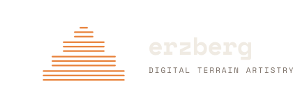
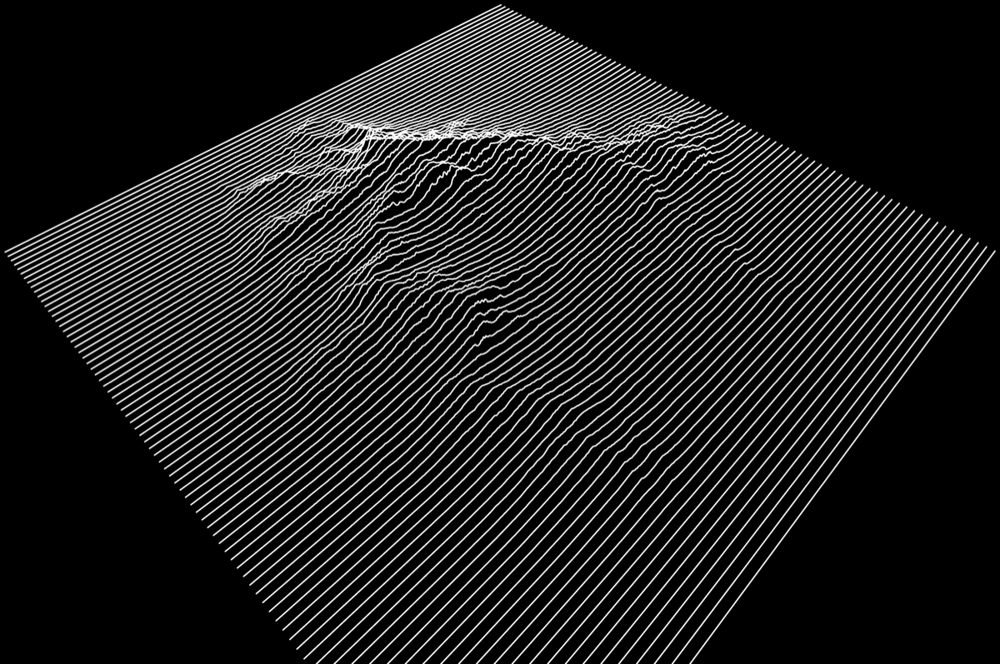
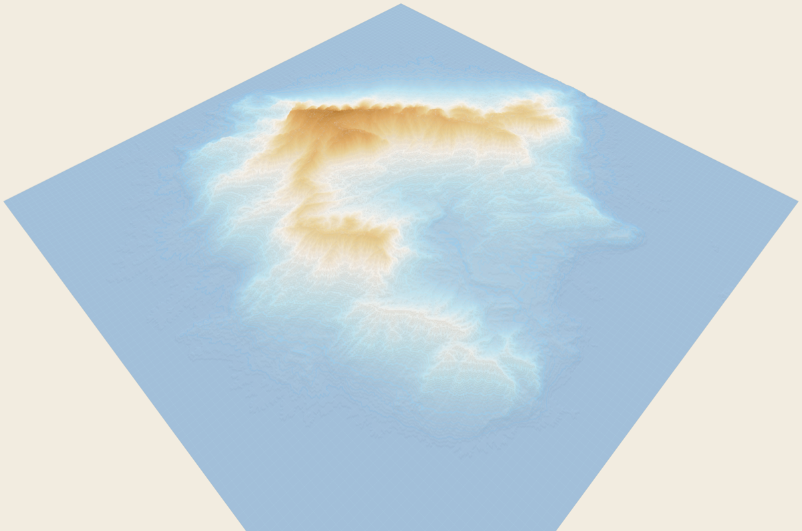
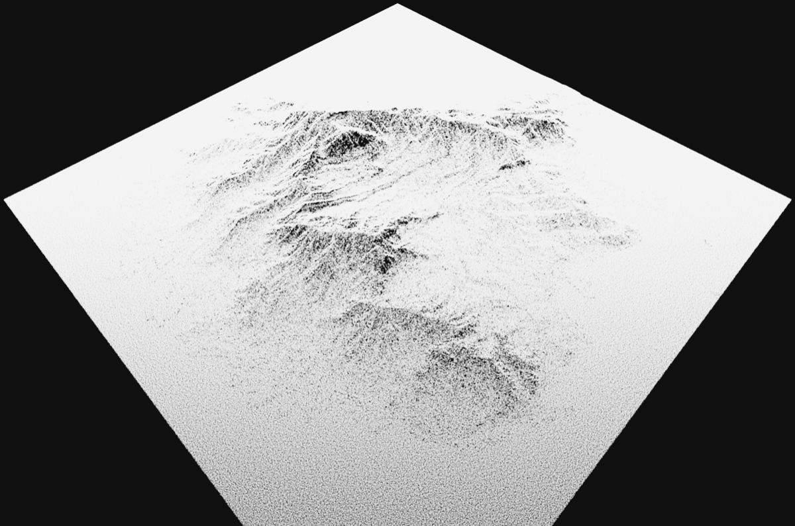
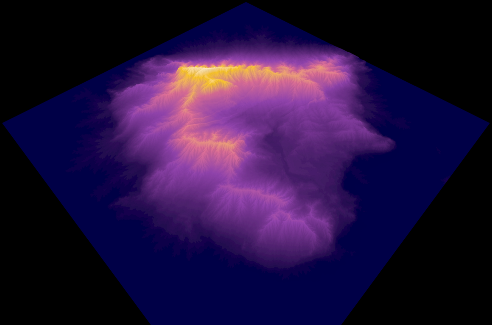
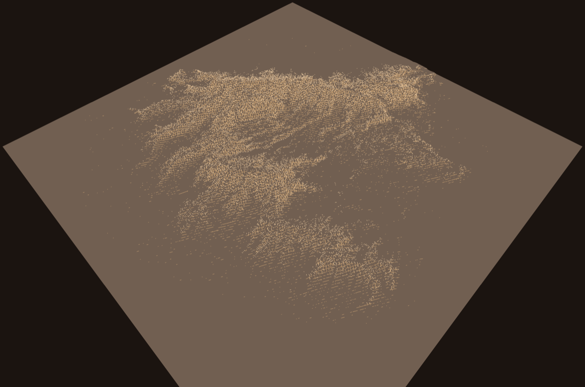
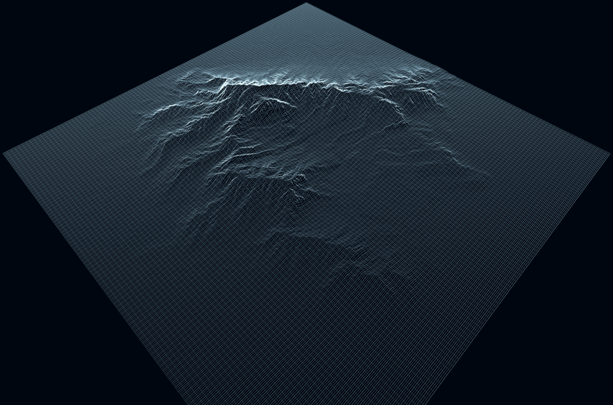
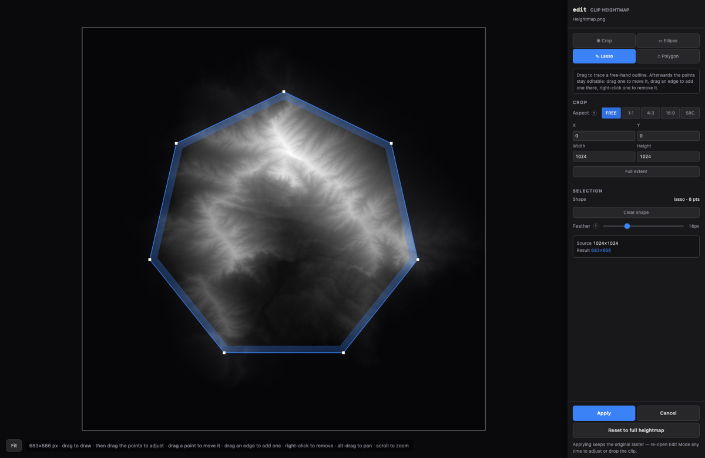

<p align="center">
  
</p>

<p align="center">
  <a href="https://github.com/sorny/erzberg/actions/workflows/deploy.yml"></a>
  <a href="https://opensource.org/licenses/MIT"></a>
</p>

<p align="center">
  Turn elevation data into line art. A topographic visualisation tool built on React Three Fiber.
</p>

<p align="center">
  <b><a href="https://sorny.github.io/erzberg/">sorny.github.io/erzberg</a></b>
</p>

---

Load a greyscale heightmap (8- or 16-bit PNG), a GeoTIFF, or an audio file, and
render it as 3D line art, structural relief or an architectural sketch through
fourteen independent draw modes. Export to SVG for a pen plotter, STL for a
printer, or 4K PNG for the wall.

**Everything runs locally in your browser.** Your files never leave your
machine — no server, no upload, no account.

<table>
  <tr>
    <td width="33%"></td>
    <td width="33%"></td>
    <td width="33%"></td>
  </tr>
  <tr>
    <td align="center"><sub><b>Unknown Pleasures</b> — stacked ridgelines</sub></td>
    <td align="center"><sub><b>Alpine Survey</b> — hypsometric fill, hillshade, contours</sub></td>
    <td align="center"><sub><b>Static</b> — slope-inverted stipple dots</sub></td>
  </tr>
  <tr>
    <td></td>
    <td></td>
    <td></td>
  </tr>
  <tr>
    <td align="center"><sub><b>Thermal Camera</b> — hypsometric fill + sky-view AO</sub></td>
    <td align="center"><sub><b>Copper Plate</b> — curvature engraving</sub></td>
    <td align="center"><sub><b>X-Ray</b> — lines and crosshatch, ghost-occluded</sub></td>
  </tr>
</table>

<sub>Six of the 56 bundled presets, all rendered from the same sample heightmap
through the app's own PNG exporter.</sub>

---

## Quick start

Use the [hosted version](https://sorny.github.io/erzberg/), or run it yourself:

```bash
npm install
npm run dev              # http://localhost:5173
```

The app opens on a bundled sample heightmap, so there is something to look at
before you load anything. Start with a style preset, then tune.

---

## Input

| Source | Notes |
|---|---|
| **PNG** | 8-bit, or 16-bit decoded natively — the canvas path would silently truncate it to 8. Alpha is read as NoData. |
| **GeoTIFF** | Real elevation, with the file's coordinate system reported rather than assumed, its declared NoData honoured, and vertical exaggeration suggested from the real ground size of a pixel. |
| **Audio** | MP3 / WAV / OGG / M4A, analysed into a spectrogram that drives the terrain. |
| **GPX** | Draped over a georeferenced raster as a track line. |

**Georeferenced input, stated rather than assumed.** A GeoTIFF reports its
coordinate system in the sidebar — `WGS 84 / UTM zone 33N (EPSG:32633)` — and
says when a reading rests on an assumption instead of implying a precision it
lacks. Tracks are projected from WGS84 into the raster's own grid: geographic
CRS, Web Mercator, and the WGS84/ETRS89/NAD83/NAD27 UTM zone blocks. National
grids needing Lambert or Gauss-Krüger maths plus a datum shift are named and
declined rather than approximated — an overlay quietly 400 m out is worse than
one that tells you to run `gdalwarp` first. When a track does not appear, the
panel distinguishes the three reasons that otherwise look identical: not
projectable, not georeferenced, or projected fine and lying somewhere else.
→ [Georeferencing](docs/Georeferencing.md)

---

## Edit Mode



Press `E` and the viewport becomes a flat picture of the raster. Crop it with a
handled rectangle (aspect locks, numeric fields), draw an ellipse — Shift for a
perfect circle — or cut out an arbitrary region with a lasso or polygon. A lasso
or polygon stays editable once closed: drag a point to move it, drag an edge to
add one, right-click to remove. The result is centred automatically, and Feather
ramps the clipped edge down to the terrain's own base level instead of ending it
in a cliff.

The clip is non-destructive: the original raster is kept, so Edit Mode can be
re-entered to adjust it or cleared to get the whole heightmap back. It works the
same on a PNG, a GeoTIFF and a Soundscape, and a GeoTIFF's bounding box is
re-derived over the crop so a GPX track stays where it belongs.
→ [Edit Mode](docs/Edit-Mode.md)

---

## Draw modes

Every mode runs independently, with its own colour, weight, dash pattern and
hypsometric tinting. → [Draw mode mathematics](docs/Draw-Modes.md)

| Mode | Technique |
|---|---|
| Lines | Parallel terrain ridgelines at any bearing angle |
| Crosshatch | Two perpendicular line sets at a configurable angle |
| Pillars | Vertical extrusion per cell (line, cuboid or cylinder) |
| Contours | Marching Squares isolines, GIS-unit-aware, with optional ring closing and Chaikin smoothing for soft "form lines" |
| Hachure | Slope-directed short strokes |
| Flow Lines | Euler-integrated drainage paths |
| Stream Network | Strahler-order flow accumulation |
| Pencil Shading | Laplacian curvature detection |
| Ridge Detection | Hessian eigenvalue crest extraction |
| Valley Detection | Topographic Position Index troughs |
| Stipple Dots | Stochastic dot density driven by slope or elevation |
| Engraving | Copperplate illumination cross-hatch — shadows accumulate over up to 4 stacked stroke directions |
| Curvature | Evenly spaced streamlines through the principal-curvature direction field — strokes wrap the shape rather than the light |
| Rock & Scree | Swisstopo-style cliff hachures plus slope-graded debris dots |

**Layered ghost occlusion.** Each line segment generates an invisible 3D curtain
mesh acting as a depth buffer, so lines occlude other lines instead of being
swallowed by the terrain surface. Hidden segments can be drawn in their own
colour and opacity for an X-ray effect.

**Reproducible randomness.** The stochastic modes (Stipple, Rock & Scree) each
carry a seed — the same seed always reproduces the identical pattern, so a piece
can be regenerated exactly.

**56 style presets** ship with the app, each a complete look: draw modes,
colours, gradients and particle settings — shown as thumbnails rather than a
wall of identical buttons.

**Surprise me.** A seeded randomiser that rolls a look rather than shuffling
250 sliders: it picks paper or ink, one to three draw modes against a cost
budget, a palette, and at most one surface overlay, then checks the ink against
the background so nothing comes back invisible. The seed is shown and the arrow
steps back through recent rolls — the seed *is* the look, so it can always be
returned to.

---

## Surface overlays

- **Hillshade** with physically-based ray-marched cast shadows: ridgelines
  occlude sunlight through a horizon-angle comparison along a progressive-step
  heightmap ray, with configurable darkness, softness (penumbra) and quality.
  Azimuth and altitude drive both the Lambert shading and the shadows, and an
  amber sun indicator marks the light in the scene. Multi-directional mode
  blends several azimuths.
- **Slope shading** — a two-colour steepness gradient blended over the fill.
- **Aspect map** — slope direction as a hue wheel.
- **Sky View Factor** ambient occlusion, ray-marched over the sky hemisphere.
- **Water fill** at a chosen level, and **Tanaka illumination** that splits
  contours into thick-bright and thin-dark halves.
- **Hypsometric tinting** per layer, driven by a shared editable gradient.
- **Texture overlay** with blend modes, scale and offset.

---

## Terrain tools

- **Raw terrain view** — a one-toggle look at the data behind the art: the
  heightmap as a flat greyscale plane, lowest point black and highest white,
  stretched so a raster occupying only part of the range still reads at full
  contrast. It reflects resolution, blur, Levels and the elevation cuts, so it
  doubles as a live preview while tuning them. Flattening happens in the shader,
  so the toggle costs no rebuild and every exporter still sees the real terrain.
- **Levels** — black/white points over a live histogram, plus elevation cuts.
- **Hydraulic erosion** — droplet simulation following
  [Hans Beyer's method](https://ardordeosis.github.io/implementation-of-a-method-for-hydraulic-erosion/thesis-beyer.pdf),
  off the main thread. → [Hydraulic erosion](docs/Hydraulic-Erosion.md)
- **Mirror** — reflect the raster on X or Y for kaleidoscopic terrain, and
  render octants selectively.
- **Analysis** — click two points for an elevation cross-section; the
  hypsometric integral is reported continuously.
- **Hologram particles** — an optional GPU-animated point cloud. A single time
  uniform drives per-particle float and two-octave fractal-noise displacement
  gated by a moving scan mask; all animation lives in the vertex shader, so
  nothing is looped or re-uploaded per frame, and the glowing sprites are faked
  in the fragment shader with no post-processing pass.

---

## Soundscapes

Upload a track and it becomes terrain. The audio is decoded and analysed once,
off-thread, into a full spectrogram — radix-2 FFT, Hann-windowed STFT at 75%
overlap, log or linear frequency binning — and playback then *streams* a
scrolling window of that spectrogram into the same slot a raster would occupy,
so every draw mode, overlay and exporter works on it unchanged. The spectrogram
is drawn in the sidebar with a playhead and a highlight marking the slice
currently feeding the terrain; click or drag to seek. Because the analysis is
stored as dB over a fixed range, the noise gate and contrast controls re-slice
the stored result instead of re-running the FFT.

*Freeze Whole Track* writes the entire track as one static heightmap for the
tools that need a terrain that holds still — and it can take five shapes: a
stretched spectrogram, a **Disc** wound like a record (match the turn count to
the bar count and repeats line up radially), a **Similarity** matrix where
repeated choruses become diagonal stripes, a **Weave** folded onto the detected
bar grid so the groove stacks into ridges, or **Strata** stacking loudness,
brightness, onset density and harmony as layers over one timeline.
→ [Soundscapes](docs/Soundscapes.md)

---

## Export

| Format | Notes |
|---|---|
| **SVG** | Software Z-buffer projection with fill-based terrain occlusion, per-mode Inkscape/Illustrator layers, dash patterns faithfully reproduced |
| **PNG** | 4K with MSAA, trimmed to content |
| **PNG α** | Transparent background |
| **STL** | Watertight mesh for 3D printing |
| **Heightmap PNG** | The processed greyscale raster |
| **WebM** | Screen recording of the live canvas |

Exports are named after the source file: uploading `graz.tif` produces
`graz.svg`, `graz.png`, `graz-alpha.png`, `graz.stl`, `graz-heightmap.png` and
`graz.webm`. Presets save and load as JSON, optionally carrying the heightmap
with them.

---

## Keyboard

| Key | Action |
|---|---|
| `E` | Enter Edit Mode |
| `Esc` | Cancel the shape being drawn, leave Edit Mode, or cancel elevation-profile picking |
| `Enter` | Close the shape being drawn, or apply the clip |
| `Backspace` | Remove the last polygon vertex |
| `Shift` | While drawing or resizing an ellipse, constrain it to a circle |
| Right-click | Remove a point from a committed lasso or polygon |
| `Q` | Toggle auto-rotate |
| `1` – `5` | Export SVG, PNG, PNG α, STL, WebM |

---

## Performance

The app is built to idle quietly and stay responsive under load.

- **On-demand rendering.** The canvas draws a frame only when something changes,
  so a static scene leaves the GPU near-idle. Continuous animations keep the loop
  alive only while they run.
- **60 fps camera.** Orbit, pan and zoom move the camera on the fast path while
  React state follows on a throttled tick, so the sidebar never re-renders
  per frame.
- **Off-thread geometry.** Rebuilds run in a long-lived worker over growable
  typed-array writers and come back zero-copy, including surface normals.
  Single-pass marching-squares contours are ~18× faster than per-level scanning.
  The worker caches the source raster, so moving a slider sends parameters
  instead of re-copying a 256 MB raster.
- **Coalesced rebuilds.** Requests arriving faster than builds complete are
  queued newest-wins rather than cancelled — cancelling each one meant nothing
  ever finished under a continuous stream. A build is killed only when it is a
  genuine outlier against the current cadence.
- **Don't compute what nothing will look at.** Purely visual controls never
  trigger a rebuild; surface normals and UVs are skipped when no fill layer
  draws them; the particle field, occlusion curtains and the 268 MB ray-marching
  texture are built only when something needs them; the full-resolution blur is
  cached against the raster and radius. Smoothed contours are decimated with
  Douglas–Peucker between Chaikin passes, keeping 40× the geometry off the GPU
  for a deviation well under a pixel. SVG export scales occlusion sampling to
  each segment's screen length rather than taking a flat 64 samples
  (1042 ms → 265 ms).
- **Supersampling.** Hairline art is finer than the pixel grid and can shimmer
  in motion. An optional slider renders internally at up to 2× the device pixel
  ratio — measured ~93% fewer hard pixel flips during a slow rotate — trading
  fill rate for a calm, print-like image.

---

## Tech stack

| Layer | Library |
|---|---|
| 3D engine | React Three Fiber + Three.js |
| State | Zustand (raster data) + React state (all UI params) |
| GIS parsing | GeoTIFF.js |
| UI | Custom sidebar panel + Tailwind CSS |
| Geometry | Web Workers (geometry, erosion, spectrogram) |
| Audio | Web Audio `decodeAudioData` + in-house radix-2 FFT (no dependency) |
| Tests | Playwright, against a live dev server in real Chrome |

---

## Documentation

- [Architecture: how a file becomes a picture](docs/Architecture.md)
- [Draw mode mathematics](docs/Draw-Modes.md)
- [Edit Mode: cropping and selections](docs/Edit-Mode.md)
- [Georeferencing: projections, GPX tracks, elevation](docs/Georeferencing.md)
- [Hydraulic erosion algorithm](docs/Hydraulic-Erosion.md)
- [Soundscapes: audio → terrain](docs/Soundscapes.md)
- [Changelog](CHANGELOG.md)

---

## Development

```bash
npm install
npm run dev              # dev server at http://localhost:5173
npm run build            # production build
npm run test             # Playwright end-to-end suite
npm run test:ui          # Playwright interactive UI
npx playwright test tests/lines.spec.js   # a single spec
npm run update-presets   # round-trip all presets through the live app
npm run thumbs           # regenerate the preset thumbnails
```

`update-presets` and `thumbs` both drive the running dev server with Playwright,
so start `npm run dev` first. `thumbs` renders each preset through the app's own
PNG exporter and scales it down in-browser, so it needs no image tooling on the
host.

Tests run against a live dev server in non-headless Chrome with WebGL enabled,
because the things worth asserting — what the geometry worker produced, what the
SVG exporter drew, whether the drawing buffer was clamped — only exist in a real
renderer. Some specs depend on fixtures that are gitignored for size; those skip
with a message rather than failing. See
[tests/testdata/README.md](tests/testdata/README.md).

---

## License

MIT — Copyright (c) 2026 sorny.
